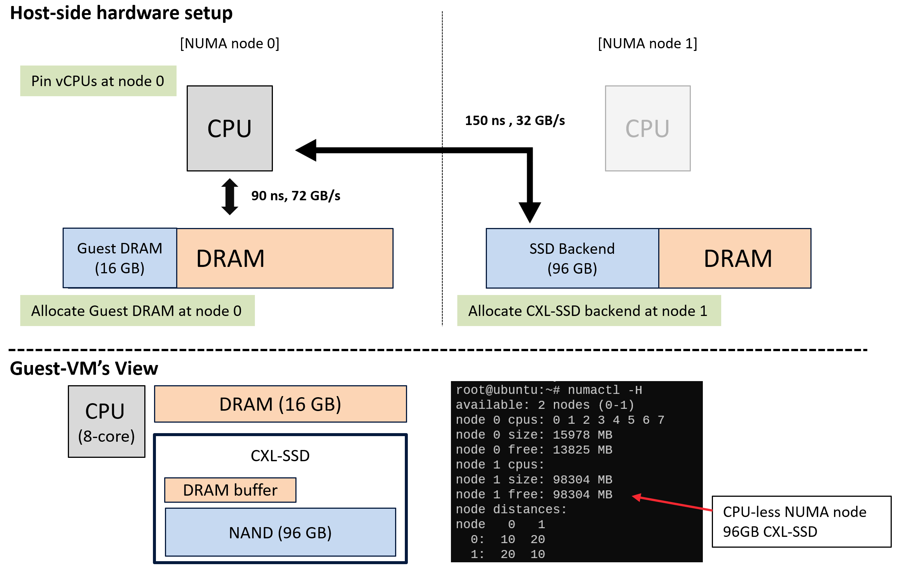

## Setup host

### Install Cylon kernel
* Get source form CylonLinux github and install
* If you're unfamiliar with kernel installation, please refer to this guide: https://phoenixnap.com/kb/build-linux-kernel
```sh
git clone https://github.com/MoatLab/CylonLinux -b cxlssd
```

### Reserve physical memory
<!-- env_setup.png -->
* Example

  

* It is needed to allocate memory for SSD backend on remote numa node
* To simplify manage the backend memory and SPTE entries, Cylon allocates physically continuous memory
* To prevent the OS and applications from touching those memory pages, we need to reserve memory

* Select proper memory range by checking memory address.
```sh
> lsmem
RANGE                                  SIZE  STATE REMOVABLE   BLOCK
0x0000000000000000-0x000000007fffffff    2G online       yes       0    
0x0000000100000000-0x000000307fffffff  190G online       yes    2-96    # Numa node 0
0x000000ae80000000-0x000000de7fffffff  192G online       yes 350-444    # Numa node 1

Memory block size:         2G
Total online memory:     384G
Total offline memory:      0B

> sudo cat /proc/iomem  
...
100000000-307fffffff : System RAM          # Numa node 0
  1c26e00000-1c27ffffff : Kernel code
  1c28000000-1c28c38fff : Kernel rodata
  1c28e00000-1c2920e93f : Kernel data
  1c296c2000-1c2a7fffff : Kernel bss

...
ae80000000-de7fffffff : System RAM         # Numa node 1
...

```

* Update grub. Add `memmap=[size]![start]` command. For example, to reserve `96GB` of memory from address `0xae80000000`(start address of numa node 1):
```sh
# /etc/default/grub

GRUB_DEFAULT=0
GRUB_TIMEOUT_STYLE=hidden
GRUB_TIMEOUT=0
GRUB_DISTRIBUTOR=`lsb_release -i -s 2> /dev/null || echo Debian`
GRUB_CMDLINE_LINUX_DEFAULT="quiet splash"
GRUB_CMDLINE_LINUX="memmap=96G!698G "

```

* After reboot, memory will be shown like:
```sh
> lsmem
RANGE                                  SIZE  STATE REMOVABLE   BLOCK
0x0000000000000000-0x000000007fffffff    2G online       yes       0
0x0000000100000000-0x000000307fffffff  190G online       yes    2-96
0x000000c680000000-0x000000de7fffffff   96G online       yes 397-444

Memory block size:         2G
Total online memory:     288G
Total offline memory:      0B

> sudo cat /proc/iomem  
...
100000000-307fffffff : System RAM          # Numa node 0
  1c26e00000-1c27ffffff : Kernel code
  1c28000000-1c28c38fff : Kernel rodata
  1c28e00000-1c2920e93f : Kernel data
  1c296c2000-1c2a7fffff : Kernel bss
...
ae80000000-c67fffffff : Persistent Memory (legacy) # Reserved memory is exposed as a persistent memory device
  ae80000000-c67fffffff : namespace0.0
c680000000-de7fffffff : System RAM         # node 1 system memory
...

```


### Install Cylon
```sh
git clone https://github.com/MoatLab/Cylon -b cxlssd
cd Cylon
 mkdir build-femu
# Switch to the FEMU building directory
cd build-femu
# Copy femu script
cp ../femu-scripts/femu-copy-scripts.sh .
./femu-copy-scripts.sh .
# only Debian/Ubuntu based distributions supported
sudo ./pkgdep.sh

# Compile
./femu-compile.sh
```
* You need to set configurations in `run-cxlssd.sh`
```sh
# run-cxlssd.sh:25
backend_dev="/dev/mem"
bdev_offset=0xae80000000  #Change this value
```

* After building Cylon, launch `run-cxlssd.sh 98304` (98304MB = 96GB)
* Currently, NAND latency is set to 0


## Setup Guest

### Install kernel
* Install CXL-supported kernel (We have only tested on v6.4.6)
* Setup following config flags:
```sh
sudo scripts/config --enable CONFIG_CXL_BUS
sudo scripts/config --enable CONFIG_CXL_PCI
sudo scripts/config --enable CONFIG_CXL_ACPI
sudo scripts/config --enable CONFIG_CXL_PMEM
sudo scripts/config --enable CONFIG_CXL_MEM
sudo scripts/config --enable CONFIG_CXL_PORT
sudo scripts/config --enable CONFIG_CXL_SUSPEND
sudo scripts/config --enable CONFIG_CXL_REGION
sudo scripts/config --enable CONFIG_DEV_DAX_CXL
sudo scripts/config --enable CXL_REGION_INVALIDATION_TEST
sudo scripts/config --enable CONFIG_CXL_MEM_RAW_COMMANDS

sudo scripts/config --enable CONFIG_LIBNVDIMM
sudo scripts/config --enable CONFIG_NVDIMM_PFN
sudo scripts/config --enable CONFIG_NVDIMM_DAX
sudo scripts/config --enable CONFIG_NVDIMM_KEYS
sudo scripts/config --enable CONFIG_STRICT_DEVMEM
sudo scripts/config --enable CONFIG_IO_STRICT_DEVMEM
sudo scripts/config --enable CONFIG_NVDIMM_SECURITY_TEST

# disable hotplug_default_online
sudo scripts/config --disable CONFIG_MEMORY_HOTPLUG_DEFAULT_ONLINE

```

### Install ndctl
* Install dependencies
```sh
sudo apt install -y git gcc g++ autoconf automake asciidoc asciidoctor bash-completion xmlto libtool pkg-config libglib2.0-0 libglib2.0-dev libfabric1 libfabric-dev doxygen graphviz pandoc libncurses5 libkmod2 libkmod-dev libudev-dev uuid-dev libjson-c-dev libkeyutils-dev libiniparser1 libiniparser-dev meson numactl libtraceevent-dev libtracefs-dev
```

* Install ndctl
```
git clone https://github.com/pmem/ndctl
cd ndctl
git checkout v77
meson setup build
meson compile -C build
meson install -C build
```

### Setup CXL memory
```sh
# Online memory
cxl create-region -m -t ram  -d decoder0.0 -w 1 -g 4096 mem0

# Expose as devdax device
daxctl reconfigure-device --mode=devdax --force dax0.0

# Touch every memory pages of CXL SSD
./cxl_warmup

# Online memory again
daxctl reconfigure-device --mode=system-ram --force dax0.0

# Then, CXL SSD will be shown like CPU-less numa node (
> numactl -H 
available: 2 nodes (0-1)
node 0 cpus: 0 1 2 3 4 5 6 7
node 0 size: 32082 MB
node 0 free: 29782 MB
node 1 cpus:
node 1 size: 98304 MB
node 1 free: 98304 MB
node distances:
node   0   1
  0:  10  20
  1:  20  10

```


* cxl_warmup.c (build command: `gcc -o cxl_warmup cxl_warmup.c -fopenmp`)
```c
#include <stdlib.h>
#include <stdio.h>
#include <assert.h>
#include <unistd.h>
#include <sys/time.h>
#include <fcntl.h>
#include <sys/types.h>
#include <sys/stat.h>
#include <sys/mman.h>
#include <sys/syscall.h>
#include <sys/ioctl.h>
#include <stdint.h>
#include <time.h>

#define MMAP_SIZE ((uint64_t)96*1024*1024*1024)

#include <omp.h>
int main(int argc, char** argv){

  uint64_t sz = MMAP_SIZE;
  if (argc==2)
    sz = (uint64_t)atoi(argv[1])*1024*1024*1024;


  printf("FEMU cxl-ssd device Warm-up:\n\t Trigger EPT_VIOLATION for all pages\n");
  int fd = open("/dev/dax0.0", O_RDWR);
  if (fd < 0) {
    perror("open: ");
    exit(0);
  }

  uint64_t *cxl = (uint64_t*)mmap(NULL, sz, PROT_READ|PROT_WRITE, MAP_SHARED, fd, 0);
  if (cxl == MAP_FAILED) {
    perror("mmap: ");
    exit(0);
  }
  int a = 0;
  printf("Size: %.1f GB\n", sz/1024./1024./1024.);

  #pragma omp parallel for num_threads(8)
  for (uint64_t i=0;i<sz/8;i+=4096/8) {
    cxl[i] = 0;
  }

  munmap(cxl, sz);

  close(fd);
  printf("Done\n");
  return 0;
}

```
